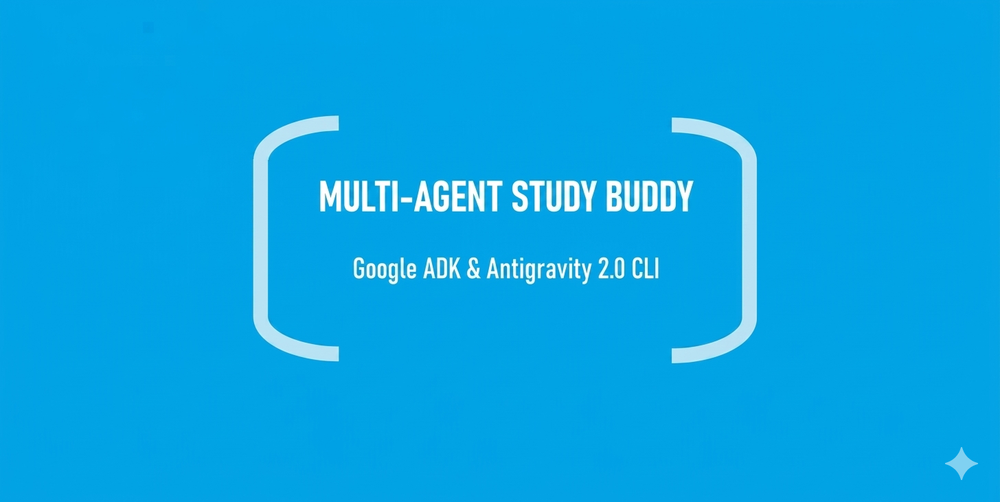

# Multi-Agent Study Buddy (Google Antigravity SDK)

An adaptive, conversational learning assistant built for the Google's X Kaggle's AI Agents: Intensive Vibe Coding Capstone Project {from "5-Day AI Agents: Intensive Vibe Coding Course With Google" Course} It splits responsibilities between a quiz-generating professor and a strict evaluator while implementing a custom file-writing tool guarded by human-in-the-loop security.

## 🚀 Setup & Installation

Follow these quick steps to run the agent locally on your machine.

### 1. Prerequisites
Make sure you have Python 3.10 or higher installed on your system.

### 2. Navigate to Project
```cmd
cd study_buddy_agent
```

### 3. Install Dependencies
```bash
pip install google-antigravity
```

### 4. Configure Your API Key
Get a free Gemini API key from Google AI Studio and set it in your terminal environment:

**On Windows (CMD):**
```cmd
set GEMINI_API_KEY=your_actual_api_key_here
```

**On Mac/Linux:**
```bash
export GEMINI_API_KEY="your_actual_api_key_here"
```

### 5. Run the Agent
```bash
python main.py
```
### Youtube
https://www.youtube.com/watch?v=kYVtXpdyTN8

### 🛡️ Architecture & Features
* **Multi-Agent Simulation:** Orchestrates transitions between ProfessorAgent and GraderAgent roles within the system loop.
* **Custom MCP Tool:** Features a local Python file writer (`tools.py`) to save generated report cards to disk.
* **Human-in-the-Loop:** Actively prompts the user for disk-write authorization (Y/N) before running local operations.

---

### What is this file for?
When you upload your project files (`main.py`, `tools.py`, and this new `README.md`) to **GitHub** later, GitHub will automatically read this file and turn it into a beautiful, professionally formatted instruction page for the judges!

---

### 👨‍💻 Developer Profile
* **Name:** Aaron Thalakkottor Sooraj
* **Degree:** B.Tech in Computer Science Engineering (CSE)
* **Institution:** Vidya Academy of Science and Technology, Thrissur
* Project built for the Google AI Agents Intensive Capstone Project (2026)

---

### 📜 License
```text
COPYRIGHT © Since 2023 ATS-PDZ - ALL RIGHTS RESERVED.
```
